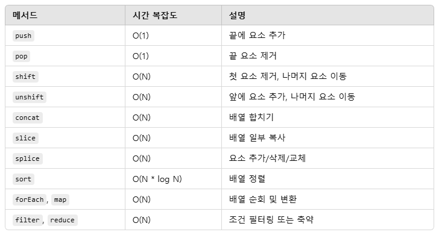

# 배열과 오브젝트의 성능 평가

## 객체를 사용하기 좋은 때
- 정렬할 필요가 없을 때
- 빠른 접근, 입력, 제거를 원할 때

## 객체에서의 Big-O
- 입력 : O(1)
- 삭제 : O(1)
- 탐색 : O(N)
- 접근 : O(1)
- Object.keys : O(N)
- Object.values : O(N)
- Object.entries : O(N)
- hasOwnProperty : O(1)

## Object.keys, Object.values, Object.entries, hasOwnProperty
### Object.keys
- 객체의 속성 이름(key)들로 이루어진 배열을 반환한다.
- 문법 : Object.keys(obj)
- 예제 코드
```
const person = { name: "Alice", age: 25, job: "Developer" };
console.log(Object.keys(person));
// 출력: ["name", "age", "job"]
```
### Object.values
- 객체의 속성 값(value)들로 이루어진 배열을 반환한다.
- 문법 : Object.values(obj)
- 예제 코드
```
const person = { name: "Alice", age: 25, job: "Developer" };
console.log(Object.values(person));
// 출력: ["Alice", 25, "Developer"]
```
### Object.entries
- 객체의 속성을 [key, value] 형태의 쌍으로 배열에 담아 반환한다.
- 문법 : Object.entries(obj)
- 예제 코드
```
const person = { name: "Alice", age: 25, job: "Developer" };
console.log(Object.entries(person));
// 출력: [["name", "Alice"], ["age", 25], ["job", "Developer"]]
```
### hasOwnProperty
- 객체가 특정 속성을 자신의 고유 속성으로 가지고 있는지 확인한다.
- 문법 : Obj.hasOwnproperty(prop)
- 예제 코드
```
const person = { name: "Alice" };
console.log(person.hasOwnProperty("name")); // true
console.log(person.hasOwnProperty("toString")); // false
```

## 배열을 사용하기 좋을 때
- 정렬이 필요할 때

## 배열에서의 Big-O
- 탐색 : O(N)
- 접근 : O(1)

## 배열의 삽입과 삭제
- 맨 앞에 삽입하거나 맨 앞의 값을 삭제할 때 : O(N) <= N개의 요소를 가진 배열의 맨 앞에 값을 건드리면, 컴퓨터는 그 뒤에 존재하게 될 N개의 요소의 인덱스를 전부 바꿔줘야 하기 때문에 컴퓨터는 N번의 연산을 진행한다.
- 맨 끝에 삽입하거나 맨 끝의 값을 삭제할 때 : O(1)

## 배열의 메소드

- 예제 코드
```
const arr = [1, 2, 3, 4];
const sliced = arr.slice(1, 3); // 새로운 배열: [2, 3]
// arr.slice(시작 인덱스, 끝 인덱스(단, 해당 인덱스는 포함하지 않음.))
console.log(sliced);

const arr = [1, 2, 3, 4];
arr.splice(1, 2, 8, 9); // 배열: [1, 8, 9, 4]
// arr.splice(시작 인덱스, 제거할 요소 개수, item1, item2, ...)
// 이때 item은 제거한 위치에 추가할 요소들
console.log(arr);

const arr = [4, 2, 3, 1];
arr.sort((a, b) => a - b); // 배열: [1, 2, 3, 4]
console.log(arr);

// forEach
arr.forEach((num) => console.log(num));

// map
const squared = arr.map((num) => num ** 2);
console.log(squared); // [1, 4, 9, 16]

// filter
const even = arr.filter((num) => num % 2 === 0);
console.log(even); // [2, 4]

// reduce
const sum = arr.reduce((acc, num) => acc + num, 0);
console.log(sum); // 10
```